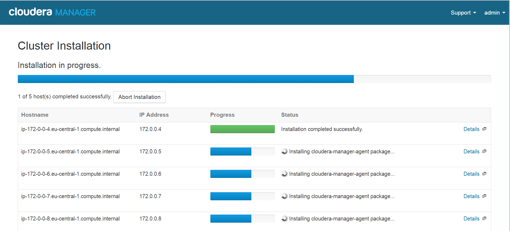
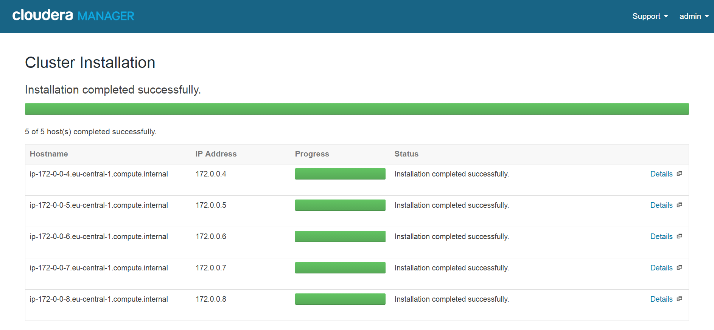
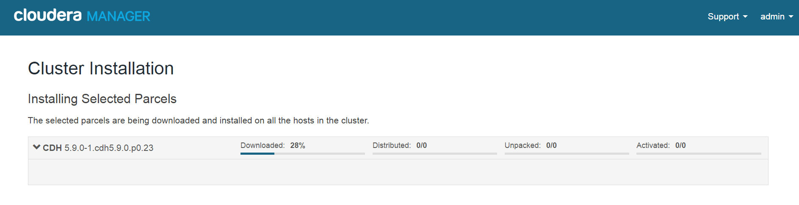
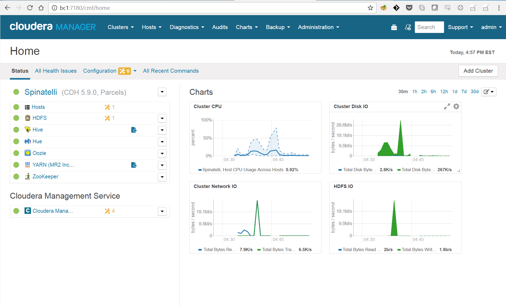
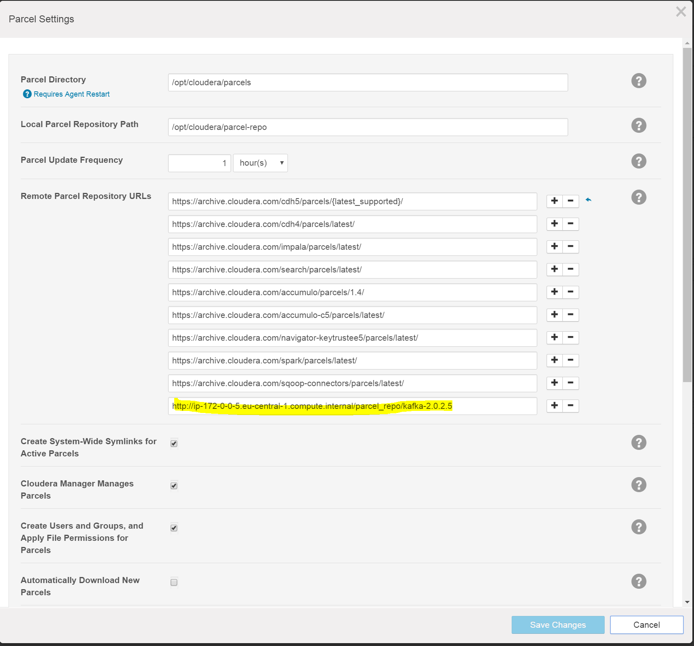
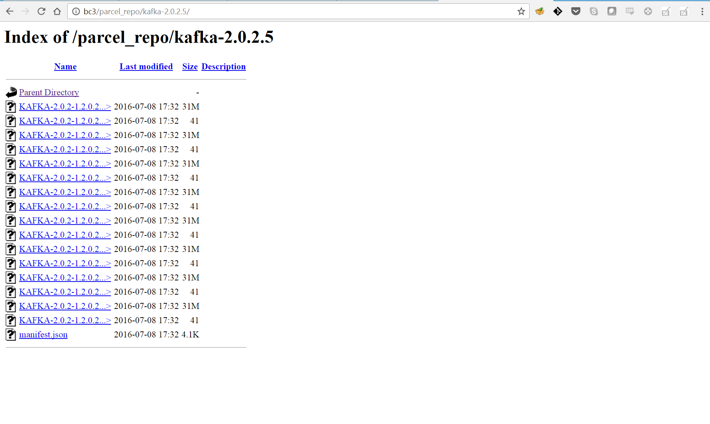

# Cloudera Manager Installation

Installed Cloudera Repo
```
[ec2-user@ip-172-0-0-4 ~]$ wget https://archive.cloudera.com/cm5/redhat/7/x86_64/cm/cloudera-manager.repo
--2016-11-14 11:04:22--  https://archive.cloudera.com/cm5/redhat/7/x86_64/cm/cloudera-manager.repo
Resolving archive.cloudera.com (archive.cloudera.com)... 151.101.12.167
Connecting to archive.cloudera.com (archive.cloudera.com)|151.101.12.167|:443... connected.
HTTP request sent, awaiting response... 200 OK
Length: 290
Saving to: ‘cloudera-manager.repo’

100%[=============================================================>] 290         --.-K/s   in 0s

2016-11-14 11:04:23 (61.0 MB/s) - ‘cloudera-manager.repo’ saved [290/290]

[ec2-user@ip-172-0-0-4 ~]$ sudo mv cloudera-manager.repo /etc/yum.repos.d/
```

Installed Cloudera Manager Server Packages:
```
[ec2-user@ip-172-0-0-4 ~]$ sudo yum install cloudera-manager-daemons cloudera-manager-server
```

Ran `scm_prepare_database.sh` script:
```
[ec2-user@ip-172-0-0-4 ~]$ sudo /usr/share/cmf/schema/scm_prepare_database.sh mysql scm scm
Enter SCM password:
JAVA_HOME=/usr/java/jdk1.8.0_111
Verifying that we can write to /etc/cloudera-scm-server
Creating SCM configuration file in /etc/cloudera-scm-server
Executing:  /usr/java/jdk1.8.0_111/bin/java -cp /usr/share/java/mysql-connector-java.jar:/usr/share/java/oracle-connector-java.jar:/usr/share/cmf/schema/../lib/* com.cloudera.enterprise.dbutil.DbCommandExecutor /etc/cloudera-scm-server/db.properties com.cloudera.cmf.db.
[                          main] DbCommandExecutor              INFO  Successfully connected to database.
All done, your SCM database is configured correctly!
```

Started Cloudera Manager Server:
```
[ec2-user@ip-172-0-0-4 ~]$ sudo service cloudera-scm-server start
```
...and waited a bit.
Then configured on the GUI the cluster with the wizard.

Installation started









All is good, I have a cluster.



### Bonus Lab
A local parcel repo has been configured to run on `bc3` a.k.a. `ip-172-0-0-5.eu-central-1.compute.internal` (private dns) using the `httpd` service.
It is reachable at http://bc3/parcel_repo
To add new parcels, `httpd` has to be stopped, the parcel has to be copied into `/var/www/html/parcel_repo/` and `httpd` has to be restarted. The new parcel will then be visible.

Parcels configuration in CM



Parcel repo list of parcels (Kafka 2.0.2.5 downloaded from Cloudera's repo)

