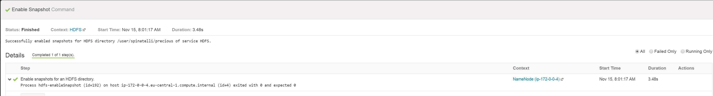
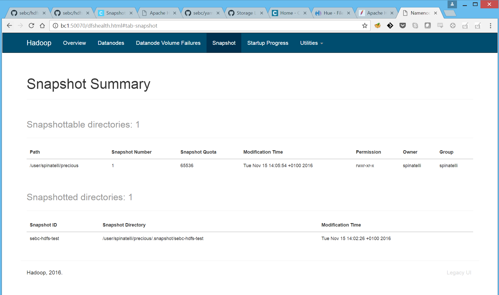
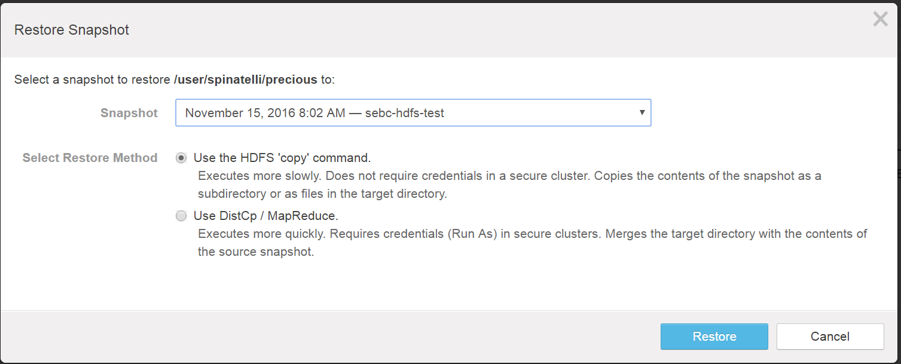
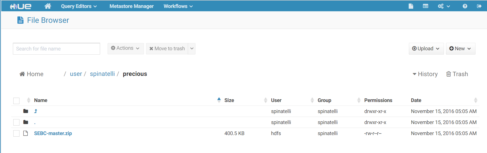

# HDFS Snapshots

Created a `precious` directory in HDFS and copied file to it:

```
[spinatelli@ip-172-0-0-4 ~]$ hadoop fs -mkdir /user/spinatelli/precious
[spinatelli@ip-172-0-0-4 ~]$ hadoop fs -put SEBC-master /user/spinatelli/precious
```

Enabled snapshots for `/user/spinatelli/precious` using Cloudera Manager (Backup->File Browser->Chose folder->Enable Snapshots)



Created a snapshot named `sebc-hdfs-test`:



Deleted the zip file:

```
[spinatelli@ip-172-0-0-4 ~]$ hadoop fs -rm /user/spinatelli/<file>
```

Restoring the deleted file:



Restored the deleted file:



